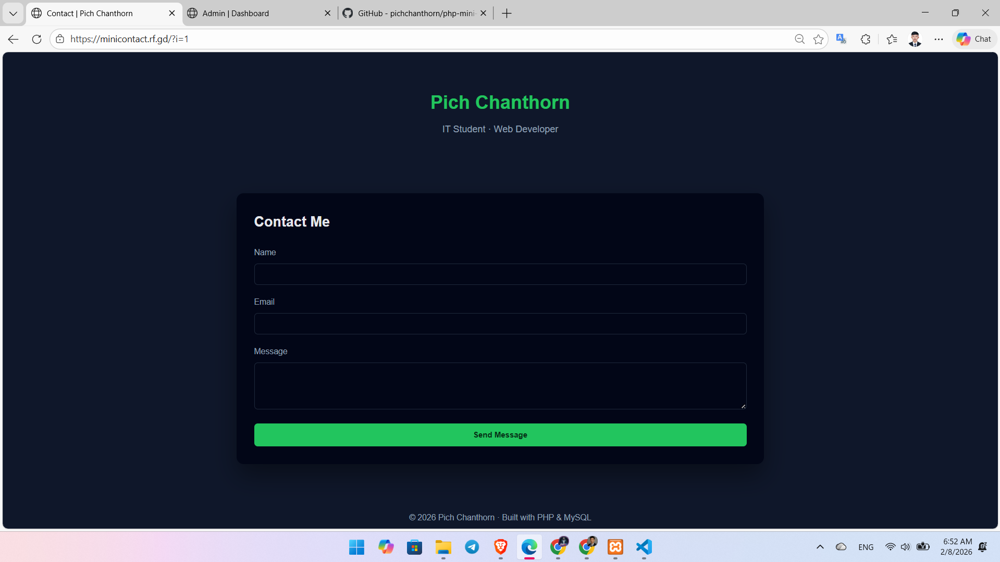
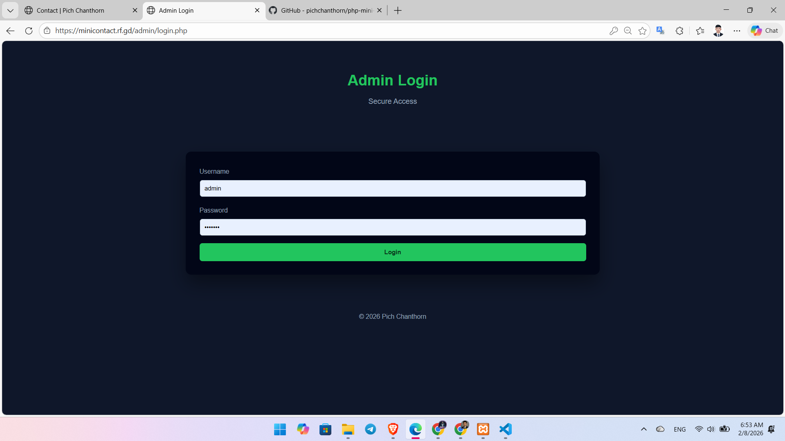
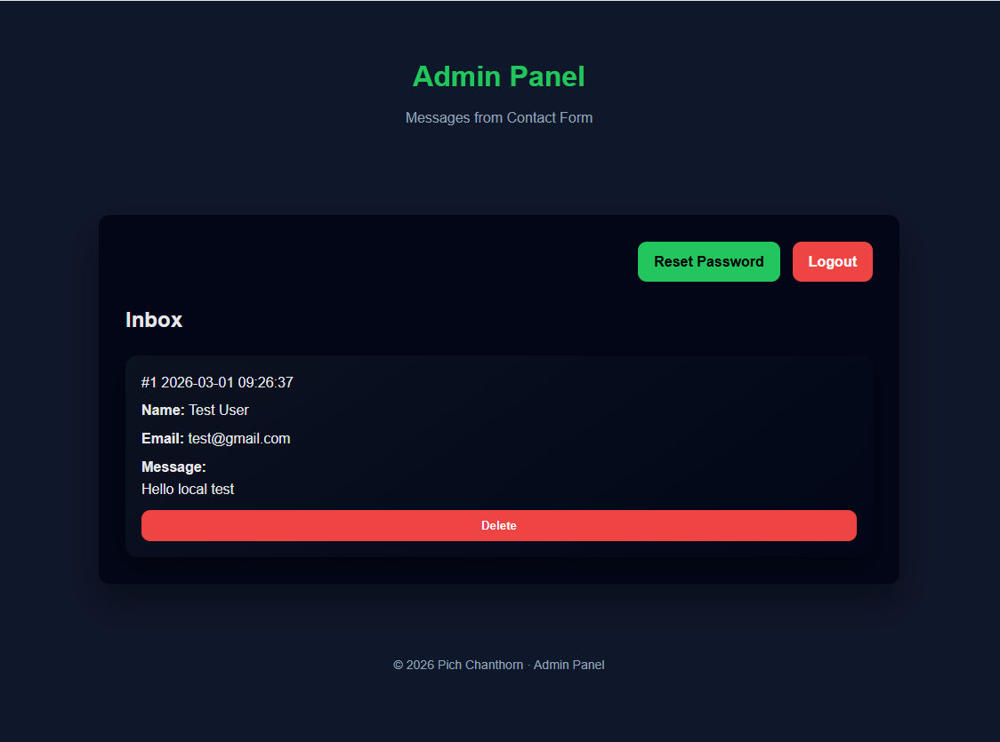
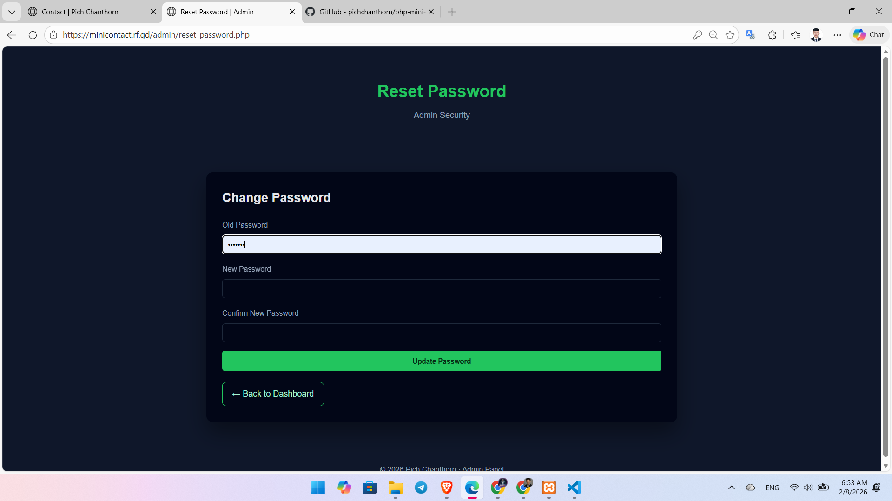

# Mini Contact Website (PHP + MySQL)

A secure and production-oriented contact management system built with **Core PHP** and **MySQL**.  
The application provides a public contact form and a protected admin area with authentication, password reset, and **GitHub OAuth** login. It is deployed live and reflects practical backend engineering patterns, secure data handling, and end-to-end deployment workflow.

---

## 📌 Project Overview

This project is designed to simulate a real-world backend web application with clear separation between public and administrative functionality:

- Public users can submit contact messages.
- Administrators can authenticate and manage incoming records.
- Authentication supports both credential-based login and GitHub OAuth.
- Core security controls are applied across authentication, session handling, and database operations.

---

## 🔗 Live Demo Links

- Website: https://minicontact.rf.gd
- Admin Panel: https://minicontact.rf.gd/admin
- GitHub OAuth Callback: https://minicontact.rf.gd/github_callback.php

---

## 🖼️ Screenshots

Production UI snapshots from the live implementation.

### 🏠 Homepage – Contact Form


### 🔐 Admin Login (Credentials + GitHub OAuth)


### 📥 Admin Dashboard – Messages Management


### 🔁 Password Reset Flow


---

## ✨ Features

### 🎨 Frontend
- Responsive contact form interface (Name, Email, Message)
- Clean and lightweight UI focused on accessibility and usability
- Clear success/error feedback for form submissions

### ⚙️ Backend
- Core PHP request handling for form processing and authentication
- MySQL persistence layer for message and admin data
- Input sanitization and server-side validation
- Modular file structure for maintainable backend logic

### 🛡️ Admin Panel
- Session-based admin authentication
- Credentials-based login and GitHub OAuth login integration
- Password reset workflow for account recovery
- Message listing and deletion from dashboard
- Secure logout and access control for restricted routes

---

## 🔐 Security Implementation

Security is treated as a first-class concern in the application design:

- **Password hashing** using `password_hash()` and verification via `password_verify()`
- **Prepared statements** for database queries to reduce SQL injection risk
- **Session-based authorization** for protected admin endpoints
- **Input validation and sanitization** before persistence and output rendering
- **OAuth-based authentication** through GitHub to reduce password attack surface

---

## 🗄️ Database Structure

### `admins`

| Column | Type | Description |
|---|---|---|
| id | INT (PK, AI) | Unique admin identifier |
| username | VARCHAR | Admin username |
| password | VARCHAR | Hashed password |
| created_at | TIMESTAMP | Record creation time |

### `messages`

| Column | Type | Description |
|---|---|---|
| id | INT (PK, AI) | Unique message identifier |
| name | VARCHAR | Sender name |
| email | VARCHAR | Sender email |
| message | TEXT | Contact message content |
| created_at | TIMESTAMP | Submission time |

---

## 🧰 Tech Stack

- **Backend:** Core PHP
- **Database:** MySQL
- **Auth:** PHP Sessions + GitHub OAuth
- **Frontend:** HTML5, CSS3
- **Local Dev Environment:** Laragon, phpMyAdmin
- **Hosting/Deployment:** InfinityFree

---

## 🚀 Deployment Workflow

1. Develop and test locally using Laragon.
2. Create and validate MySQL schema via phpMyAdmin.
3. Export local database and import into production environment.
4. Upload project files to hosting (InfinityFree).
5. Update environment-specific database and OAuth configuration.
6. Run production validation (form submission, login, OAuth callback, admin operations).

---

## 🧱 Architecture Overview

### Request Flow

```text
Client (Browser)
   ├─> index.php (public contact form)
   │     └─> process.php (validation + database insert)
   └─> admin/login.php
	  ├─> admin/process_login.php (credential auth)
	  ├─> github_login.php (OAuth start)
	  └─> github_callback.php (OAuth callback + session)
		  └─> admin/dashboard.php (protected)
			  └─> admin/delete_message.php (secured action)
```

### Application Modules

- `config/`: database and OAuth configuration
- `admin/`: authentication and message management interfaces
- Root handlers: public form and OAuth endpoints
- `assets/`: UI styling resources

---

## 🧠 Learning Outcomes

- Implemented secure authentication patterns in Core PHP
- Applied password hashing and prepared statements in production-style workflow
- Integrated third-party authentication using GitHub OAuth
- Managed environment differences between local and hosted infrastructure
- Improved debugging, deployment, and backend maintainability practices

---

## 🔭 Future Improvements

- Add CSRF tokens for all state-changing requests
- Introduce rate limiting and basic abuse protection on forms/auth endpoints
- Add audit logging for administrative actions
- Implement pagination and search for large message volumes
- Move secrets to environment variables and centralized config strategy

---

## 👤 Author

**Pich Chanthorn**  
Backend-Focused Web Developer  
Founder & CEO at PCTN  
Phnom Penh, Cambodia

---

## 📅 Year

2026
